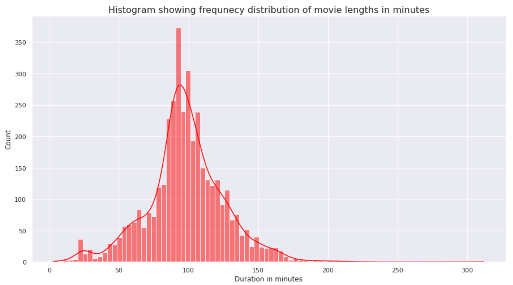
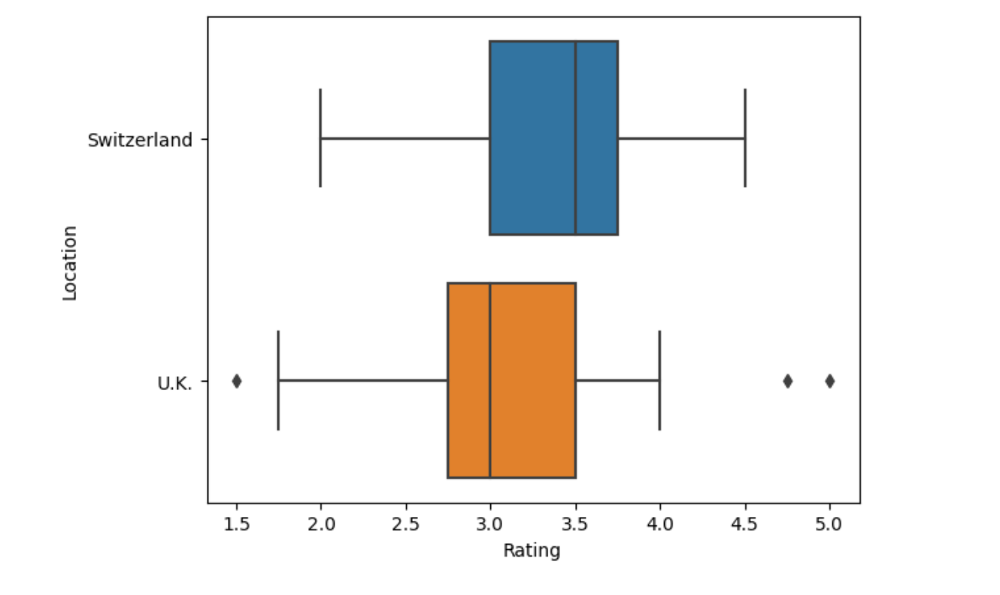

# Adam Greatorex Portfolio

Below is a summary of projects / assignments I have worked on, whilst enrolled in the 2023 Cambridge Spark Data Analyst Bootcamp. The bootcamp divides weekly modules into a mixture of class learning and set assignments. This portfolio will demonstrate the skills I have acquired throughout the course and will further display my own projects, post course completion. It is ordered as such, that my recent projects appear first.

## [Own project: London Crime Analysis using SQL and Python](https://github.com/adamgreatorex01/portfolio/blob/main/london-crime-bigquery-adam.ipynb)
This was my own project where I analysed the London Crime and Boroughs Dataset from BigQuery. In this notebook SQL queries were performed to extract data from the dataset, and then visualised through python libraries. The general analysis and questions asked were merely for me to practice sql and vizualtion tools, hence the questions and answers may not have real life application, order or meaning.

------------------------------------------------------------------------------------------------------------------------------------------------------------------

## [Capstone Project: Streaming Service Recommendation - Netflix DataSet](https://github.com/adamgreatorex01/portfolio/blob/main/CS_Streaming_report%20(3).ipynb)
In my last assignment I put together all the skills I had learnt and more!

## [Poject 10: Chocolate Ratings](https://github.com/adamgreatorex01/portfolio/blob/main/chocolate_ratings.ipynb)
In this assignment I will use a dataset with the ratings of several chocolate bars produced by companies located in different parts of the world. My focus will be on the ratings of chocolate bars produced in the UK and Switzerland. The ratings are in the range of 1-5; the higher the better.
Throughout this project, I learnt and built upon the following skills:
 - Outlier detection, through writing a function that deteremines/calculates upper and lower quartiles
 - Using a box plot to compare ratings
 - Review distributions and graphs
 

## [Project 9: Property Dataset Analysis](https://github.com/adamgreatorex01/portfolio/blob/main/Property%20Dataset.ipynb)
The assignment will focus on pre-processing data using the Pandas library, followed by the creation of plots using matplotlib and seaborn libraries. The dataset contains records for Allegheny County Office of Property Assessmemt, with 47 columns and fields such as Property Location City
Name, Fair Market Total Value and number of bedrooms.  During this project, I carried out analysis and developed skills in the following:
 - Creating a copied data frame, changing column data types to perform logical conditions 
 - Grouping subsquent data in order to conduct aggregation functions on columns and then plot these findings in a line chart
 - Create a function that takes in 2 paramters and retuns a scatter plot with the given properties contained within the function
 - Create a seaborn .violinplot() to depict summary statistics and the density of each variable.

## [Project 8: Analysis of British Road Network Use](https://github.com/adamgreatorex01/portfolio/blob/main/British%20Road%20Network%20Use.ipynb)
The assignment will focus on data aggregation and grouping using Pandas library, followed by the creation of plots using Bokeh library. **(see plots in image folder)** In this assignment, I will be analysing a dataset from the UK Department for Transport on the road network and use by different types of vehicles from 1993 - 2018. During this project I developed my competence in the following: 
 - Create a new DataFrame which has a specific row index and specific columns
 - using the .pivot method which returns a reshaped df organized by the given row index / column values.
 - Adjusting properties to a figure to improve readability
 - Setting a base index to inspect the growth over time of a variable relative to some starting value
 - Demonstrating use of plots, created through the Bokeh library
 
 

## [Project 7: Analysis of Energy Demand](https://github.com/adamgreatorex01/portfolio/blob/main/Analysis%20of%20Energy%20Demand.ipynb)
The assignment focuses on data visualisation using pandas library. In this assignment, I will be analysing a dataset from the UK government detailing energy consumption across various sectors of industry. This assignment will focus on the transformation of data and subsequent creation of charts using pandas. During this project I learnt and recapped the following skills:
- Researching how to change data types for multiple columns in one go, such as creating a dictionary then calling this in the .astype() method
- Creating a new df, based on using the .groupby() method
- Create a horizontal and stacked bar chart from the 'use' DataFrame, using the .plot() method
- Create a scatter plot of a column vs a column, to see the relationship between the two values

## [Project 6: Coronavirus World Data Analysis](https://github.com/adamgreatorex01/portfolio/blob/main/Coronavirus%20World%20Data%20Analysis.ipynb)
In this assignment, I will be analysing Coronavirus data from 'Our World in Data'. The goal of this assignment is to preprocess and analyse the data using the pandas library in Python. Within this assignment, I learnt skills and recapped previous knowledge in:
- Creating a function that accepts 3 arguments and returns a value from the first row for a given location and metric
- Creating another reusable function which returns the average value for the given metric for a given list of countries
- Returning a specific column based on a specific conditon, then taking the first value in that series to perform a calculation

## [Project 5: FTSE Market Summary & Portfolio Analysis](https://github.com/adamgreatorex01/portfolio/blob/main/ftse%20100%20analysis.ipynb)
In this assignment, I had to analyse a dataset related to Financial Times Stock Exchange 100 Index. The goal of this assignment was to preprocess and analyse the data using the Pandas library and Python tools. During this project, I learnt various new skills including:
- Data Moderation and Cleaning with Pandas, 
- Data Aggregation and Preparation with Pandas 
- Investigating if a list of tuples meet 2 requirements in the data set, and if so, the values should only appear once in a new list
- Creating a function that formats values in a specific column, such as: if the last character is a % sign, remove it, convert the string to a float, if that float is posiive, multiply it by 100, return the resulting float

## [Project 4: Python Functions & Conditionals](https://github.com/adamgreatorex01/portfolio/blob/main/functions%20and%20conditionals%20assignment.ipynb)
The project required me to define functions and then use those functions to solve problems with some datasets. The goal was for me to Instantiate and Develop Python Functions and Methods. During this assignment I developed knowlege in:
- Creating more complex conditional statements within functions, returning a dictionary and creating key value pairs, 
- Through building a function that takes in a tuple and a string as parameters, 
- Creating a function which compares 3 lists and returns a list of items which are not present in the other 2 lists. This could be used in a business sense, to see if a certain id appeared across different levels of a given range.

## [Project 3: Coronavirus Dataset - Functions Assignment](https://github.com/adamgreatorex01/portfolio/blob/main/functions%20coronavirus%20data%20set.ipynb)
The goal of this assignment was for me to make a set of functions that can be re-used on any CSV file which is in the same format as corona.csv, thus if corona.csv were updated, all of my functions could be re-used to gather the same metrics as before. This project encouarged me to learn how to write re-usable functions and practice skills in:
- Using the .zip function 
- Adding comments within functions to explain what is happening and document my own thought process 
- Use for loops to iterate through elements and utilisie conditional statements to to get required values.

## [Project 2: Vehicle Dataset](https://github.com/adamgreatorex01/portfolio/blob/main/Vehicle%20Dataset.ipynb) 
In this project, I analysed a dataset about vehicles and their characteristics. The goal of this project was to preprocess and analyse the data using the pandas library. As this was the 2nd part of using pandas, it was important that I recapped over the previous sessions content and applied these skills into the new dataset. I also explored questions using pandas documentation and visting stack overflow.
Durning this assignment, I learnt how to:
- drop na values within columns
- set a new index for my data frame
- create a fucntion that would return a value from the dataset when I entered the vehciles name as an argument.

## [Project 1: Daily stock prices for Apple](https://github.com/adamgreatorex01/portfolio/blob/main/stock%20analysis.ipynb)
In my first assignment, I analysed a dataset containing historical daily stock prices for Apple. The goal of this project was for me to preprocess and analyse data using the pandas library in Python. Within this introductory project, it was important for me to read pandas documentation, inline with answering the given questions. 
Throughout this project, I learnt new skills such as:
- sorting a dataset based on columns
- creating a subset of a dataframe
- selecting specific rows
- using methods such as idxmax
- finding stats including then mean, min and max on the data set

